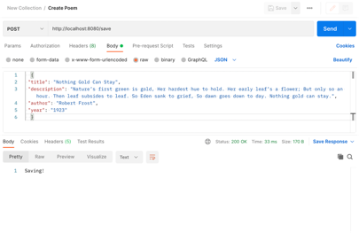
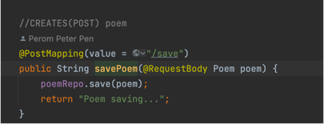
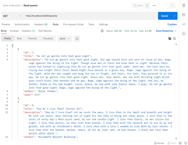
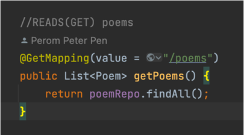
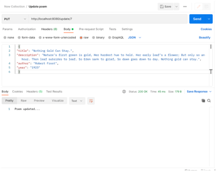
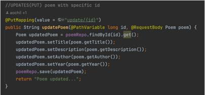
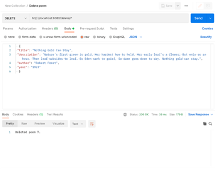
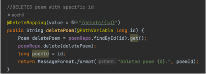

## Backend: Poem CRUD Project
This project centers around poems and implementing CRUD operations.
- Create 
- Read
- Update 
- Delete

## Technologies
- Java 17
- Maven
- Spring Boot
- JPA (Java Persistance API)
- MySQL

## Competencies
### JF 3.6
- Can implement a RESTful API
- Developed an API to:
- Create and save a poem to the database
- 
- 
- Read poems     
- 
- 
- Update a poem using it's unique identification
- 
- 
- Delete a poem using it's unique identification
- 
- 
- Implemented JPA mapping to API endpoints to perform CRUD operations. 
By accessing the endpoint, the user can perform actions to the data stored in the MySQL database.
- I've learned how to create a functioning API, which is a crucial tool for building software applications.
I'm able to define specific rules in exchanging data between components. By doing so, other users can interact with the data, and its functionality

### JF 3.2
- Can explain the principles and uses of relational and non-relational databases
- Relational databases consist of rows and columns, which is different from the way Java objects are structured. 
  It would have been a difficult process to configure how these poems will get stored in the database without JPA framework.
- Implemented JPA to map Java objects to a relational database. JPA handles the serialization and deserialization of the objects, which allows Java objects to be stored in databases.
- Using JPA significantly reduced the time it would take to configure and store poem data into the MySQL database.

### JF 1.5
- Can work effectively and contribute appropriately on a team to produce software
- I worked with a team member during the development of this project. In order to succeed as a team, 
  we discussed which technologies we will use before writing any line of code. Since we're both learning Java, 
  we came to an agreement to use Maven to manage project dependencies, Spring Boot/JPA for the API and MySQL for the database.
- Each of us took different responsibilities in this project, such as connecting the database, setting up the poem model and writing controller methods.
- Working effectively as a team allowed us to overcome many issues that we faced and allowed us to complete this project at an efficient speed.

