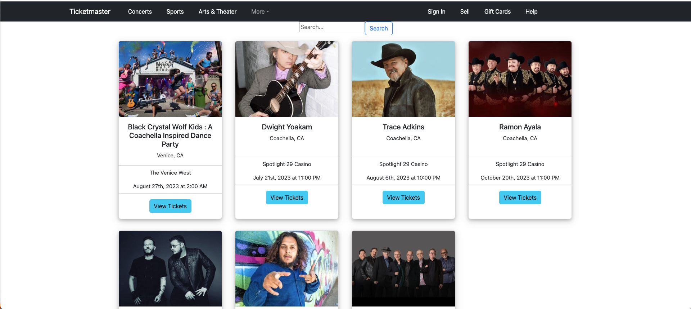
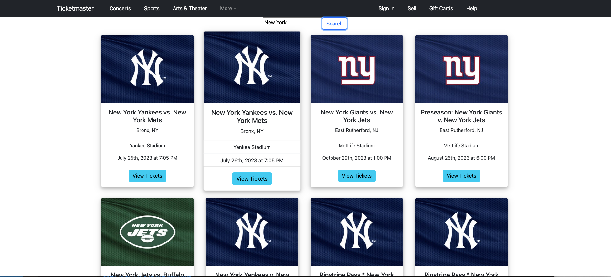
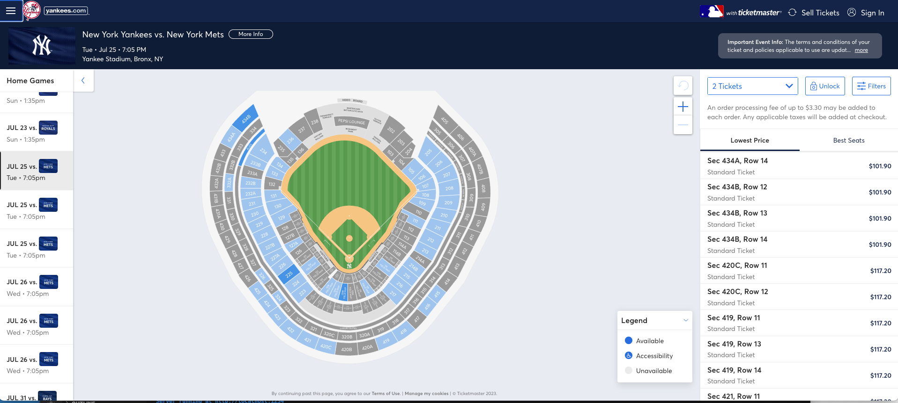
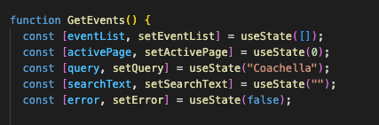
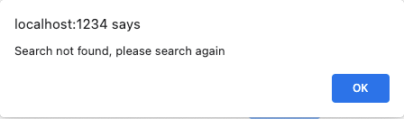

## Frontend Ticketmaster Clone
A React project to mimic the Ticketmaster website and display events based on user's search input.

## Technologies
- NodeJS
- React 18
- React-Bootstrap

## Competencies
### JF 2.5
- **Can implement a responsive User Interface**
- Render cards from the data retrieved from Ticketmaster API. 
- Before search:
- 
- After search:
- 
- Clicked View Tickets:
- 
- React was used to update and render event cards based on search input.
- Initially, the Ticketmaster API was used to retrieve all the data that matched the value from the search field. 
  After retrieving the data, I mapped across the array of events and generated a card component with key details such as the event's name, location, venue, time, and the url to the actual Ticketmaster website to purchase the event's tickets.
- I discovered the value of reusing components. I can save time by creating a card component and use it for each retrieved event instead of producing static cards one at a time.

### JF 2.7
- **Effectively manages state for complex User Interfaces**
- 
- Managed these states in order to successfully render cards for each event.
- The array eventList is where all the events are stored.
- The data array retrieved from the API contained 20 events at a time. In order to view all the events, 
  user would have to submit another request with the next page number. That is why activePage determines which group of events are being displayed. 
- The string searchText is the value from the search input. 
- The string query is the modified searchText. The API endpoint accepts keyword input, which must be separated by a comma alone.
  So, using regex, the searchText string is edited to replace any spaces between words with commas and then set as the query.
- The boolean error is used when a search is performed and no data is returned, in which the page displays an error message.
- 
- Rendering components based on data is a straightforward operation, but there is a lot of state management involved.
  I've learnt that a well, structured state management is necessary when it comes to building a fast and efficient React application.

### JF 6.6
- **Shows initiative for solving problems within their own remit, being resourceful when faced with a problem to solve**
- Each event object contained an unordered array of image objects, each with a distinct image size and url.
  I first assumed they were in the correct sequence and assigned the first picture url to the card's image source. 
  The images were rendered in different sizes and some were blurry due to the image ratio. I addressed this by mapping
  through the array of image objects and obtaining only the image url that matched the 4:3 image ratio. 
  This resolved the blurry images and size differences.
- I disliked the default date and time formatting, which didn't look good on the event cards -> "2023-07-30T23:00:00Z"
- I used Moment.js, a date formatting library to change the default date and time into this -> "December 30th, 2023 at 7:00 PM"
- Being resourceful and utilizing other libraries enabled me to drastically minimize development time.
- When faced with a challenge, no matter how large or minor, I've learned how to approach it, explore possible solutions and implement the best one.
